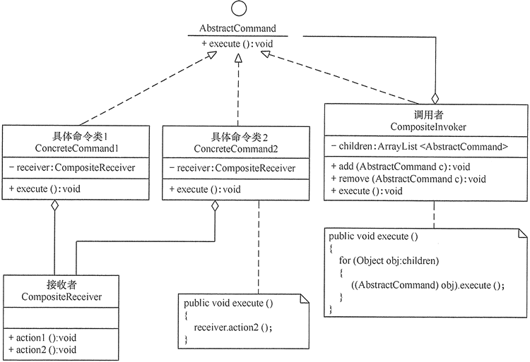

# 命令模式( Command）

在软件开发系统中，常常出现“方法的请求者”与“方法的实现者”之间存在紧密的耦合关系。这不利于软件功能的扩展与维护。例如，想对行为进行“撤销、重做、记录”等处理都很不方便，因此“如何将方法的请求者与方法的实现者解耦？”变得很重要，命令模式能很好地解决这个问题。

在现实生活中，这样的例子也很多，例如，电视机遥控器（命令发送者）通过按钮（具体命令）来遥控电视机（命令接收者），还有计算机键盘上的“功能键”等。

## 命令模式的定义与特点

命令（Command）模式的定义如下：`将一个请求封装为一个对象，使发出请求的责任和执行请求的责任分割开`。这样`两者之间通过命令对象进行沟通，这样方便将命令对象进行储存、传递、调用、增加与管理`。

命令模式的主要优点如下。

1. **降低系统的耦合度**。命令模式能`将调用操作的对象与实现该操作的对象解耦`。
2. **增加或删除命令非常方便**。采用命令模式`增加与删除命令不会影响其他类，它满足“开闭原则”，对扩展比较灵活`。
3. **可以实现宏命令**。命令模式可以与[组合模式](http://c.biancheng.net/view/1373.html)结合，将多个命令装配成一个组合命令，即宏命令。
4. **方便实现 Undo 和 Redo 操作**。命令模式可以与后面介绍的[备忘录模式](http://c.biancheng.net/view/1400.html)结合，实现命令的撤销与恢复。


其缺点是：`可能产生大量具体命令类。因为计对每一个具体操作都需要设计一个具体命令类`，这将增加系统的复杂性。

## 命令模式的结构与实现

可以将系统中的相关操作抽象成命令，使调用者与实现者相关分离，其结构如下。

#### 1. 模式的结构

命令模式包含以下主要角色。

1. **抽象命令类（Command）角色**：声明执行命令的接口，拥有执行命令的抽象方法 execute()。
2. **具体命令角色（Concrete  Command）角色**：是抽象命令类的具体实现类，它拥有接收者对象，并`通过调用接收者的功能来完成命令要执行的操作`。
3. **实现者/接收者（Receiver）角色**：执行命令功能的相关操作，是`具体命令对象业务的真正实现者`。
4. **调用者/请求者（Invoker）角色**：是请求的发送者，它通常`拥有很多的命令对象，并通过访问命令对象来执行相关请求，它不直接访问接收者`。


其结构图如图 1 所示。


图1 命令模式的结构图

#### 2. 模式的实现

命令模式的代码如下：

```java
package command;

public class CommandPattern{
    public static void main(String[] args)    {
        Command cmd=new ConcreteCommand();
        Invoker ir=new Invoker(cmd);
        System.out.println("客户访问调用者的call()方法...");
        ir.call();
    }
}

//调用者
class Invoker{
    private Command command;

    public Invoker(Command command)    {
        this.command=command;
    }

    public void setCommand(Command command)    {
        this.command=command;
    }

    public void call()    {
        System.out.println("调用者执行命令command...");
        command.execute();
    }
}

//抽象命令
public interface Command{
     abstract void execute();
}

//具体命令
class ConcreteCommand implements Command{
    private Receiver receiver;

    ConcreteCommand()    {
        receiver=new Receiver();
    }

    public void execute()    {
        receiver.action();
    }
}

//接收者
class Receiver{
    public void action()    {
        System.out.println("接收者的action()方法被调用...");
    }
}
```


程序的运行结果如下：

```
客户访问调用者的call()方法...
调用者执行命令command...
接收者的action()方法被调用...
```

## 命令模式的应用实例

【例1】用命令模式实现客户去餐馆吃早餐的实例。

分析：客户去餐馆可选择的早餐有肠粉、河粉和馄饨等，客户可向服务员选择以上早餐中的若干种，服务员将客户的请求交给相关的厨师去做。这里的`点早餐相当于“命令”，服务员相当于“调用者”，厨师相当于“接收者”`，所以用命令模式实现比较合适。

首先，定义一个早餐类（Breakfast），它是抽象命令类，有抽象方法 cooking()，说明要做什么；再定义其子类肠粉类（ChangFen）、馄饨类（HunTun）和河粉类（HeFen），它们是具体命令类，实现早餐类的 cooking() 方法，但它们不会具体做，而是交给具体的厨师去做；具体厨师类有肠粉厨师（ChangFenChef）、馄蚀厨师（HunTunChef）和河粉厨师（HeFenChef），他们是命令的接收者，由于本实例要显示厨师做菜的效果图（[点此下载要显示的效果图](http://c.biancheng.net/uploads/soft/181113/3-1Q116125200.zip)），所以把每个厨师类定义为 JFrame 的子类；最后，定义服务员类（Waiter），它接收客户的做菜请求，并发出做菜的命令。客户类是通过服务员类来点菜的，图 2 所示是其结构图。


图2 客户在餐馆吃早餐的结构图


## 命令模式的应用场景

命令模式通常适用于以下场景。

1. 当系统需要将`请求调用者与请求接收者解耦`时，命令模式使得调用者和接收者不直接交互。
2. 当系统需要`随机请求命令或经常增加或删除命令`时，命令模式比较方便实现这些功能。
3. 当`系统需要执行一组操作`时，命令模式可以定义宏命令来实现该功能。
4. 当`系统需要支持命令的撤销（Undo）操作和恢复（Redo）操作`时，可以将命令对象存储起来，采用备忘录模式来实现。

## 命令模式的扩展

在软件开发中，有时`将命令模式与前面学的组合模式联合使用`，这就构成了**宏命令模式**，也叫**组合命令模式**。宏命令包含了一组命令，它充当了具体命令与调用者的双重角色，**执行它时将递归调用它所包含的所有命令**，其具体结构图如图 3 所示。



图3 组合命令模式的结构图


程序代码如下：

```java
package command;
import java.util.ArrayList;

public class CompositeCommandPattern{
    public static void main(String[] args)    {
        AbstractCommand cmd1=new ConcreteCommand1();
        AbstractCommand cmd2=new ConcreteCommand2();

        CompositeInvoker ir=new CompositeInvoker();
        ir.add(cmd1);
        ir.add(cmd2);

        System.out.println("客户访问调用者的execute()方法...");
        ir.execute();
    }
}

//抽象命令
interface AbstractCommand{
    public abstract void execute();
}

//树叶构件: 具体命令1
class ConcreteCommand1 implements AbstractCommand{
    private CompositeReceiver receiver;

    ConcreteCommand1(){
        receiver=new CompositeReceiver();
    }

    public void execute()    {
        receiver.action1();
    }
}

//树叶构件: 具体命令2
class ConcreteCommand2 implements AbstractCommand{
    private CompositeReceiver receiver;

    ConcreteCommand2(){
        receiver=new CompositeReceiver();
    }

    public void execute(){
        receiver.action2();
    }
}

//树枝构件: 调用者
class CompositeInvoker implements AbstractCommand{
    private ArrayList<AbstractCommand> children = new ArrayList<AbstractCommand>();

    public void add(AbstractCommand c){
        children.add(c);
    }

    public void remove(AbstractCommand c){
        children.remove(c);
    }

    public AbstractCommand getChild(int i){
        return children.get(i);
    }

    public void execute(){
        for(Object obj:children)        {
            ((AbstractCommand)obj).execute();
        }
    }
}

//接收者
class CompositeReceiver{
    public void action1(){
        System.out.println("接收者的action1()方法被调用...");
    }

    public void action2(){
        System.out.println("接收者的action2()方法被调用...");
    }
}
```


程序的运行结果如下：

```
客户访问调用者的execute()方法...
接收者的action1()方法被调用...
接收者的action2()方法被调用...
```


当然，命令模式还可以同备忘录（Memento）模式组合使用，这样就变成了可撤销的命令模式，这将在后面介绍。
