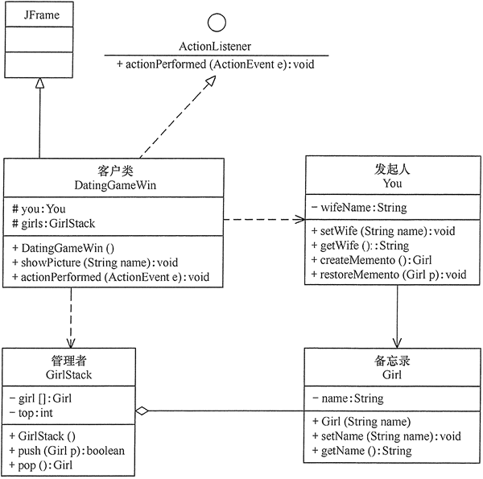

# 备忘录模式（Memento）

每个人都有犯错误的时候，都希望有种“后悔药”能弥补自己的过失，让自己重新开始，但现实是残酷的。在计算机应用中，客户同样会常常犯错误，能否提供“后悔药”给他们呢？当然是可以的，而且是有必要的。这个功能由“备忘录模式”来实现。

其实很多应用软件都提供了这项功能，如 Word、记事本、Photoshop、Eclipse 等软件在编辑时按 Ctrl+Z 组合键时能撤销当前操作，使文档恢复到之前的状态；还有在 IE 中的后退键、数据库事务管理中的回滚操作、玩游戏时的中间结果存档功能、数据库与操作系统的备份操作、棋类游戏中的悔棋功能等都属于这类。

**备忘录模式能记录一个对象的内部状态，当用户后悔时能撤销当前操作，使数据恢复到它原先的状态**。

## 模式的定义与特点

**备忘录（Memento）模式的定义：在不破坏封装性的前提下，捕获一个对象的内部状态，并在该对象之外保存这个状态，以便以后当需要时能将该对象恢复到原先保存的状态**。该模式又叫**快照模式**。

**主要优点如下**:

- 提供了一种可以恢复状态的机制。**当用户需要时能够比较方便地将数据恢复到某个历史的状态**。
- 实现了内部状态的封装。**除了创建它的发起人之外，其他对象都不能够访问这些状态信息**。
- 简化了发起人类。**发起人不需要管理和保存其内部状态的各个备份，所有状态信息都保存在备忘录中，并由管理者进行管理**，这符合单一职责原则。

**主要缺点是**：资源消耗大。如果要保存的内部状态信息过多或者特别频繁，将会占用比较大的内存资源。

## 模式的结构与实现

备忘录模式的核心是设计备忘录类以及用于管理备忘录的管理者类，现在我们来学习其结构与实现。

#### 1. 模式的结构

备忘录模式的主要角色如下。

1. **发起人（Originator）角色**：**记录当前时刻的内部状态信息，提供创建备忘录和恢复备忘录数据的功能**，实现其他业务功能，它**可以访问备忘录里的所有信息**。
2. **备忘录（Memento）角色**：**负责存储发起人的内部状态**，在需要的时候提供这些内部状态给发起人。
3. **管理者（Caretaker）角色**：**对备忘录进行管理，提供保存与获取备忘录的功能**，但其不能对备忘录的内容进行访问与修改。


备忘录模式的结构图如图 1 所示。


图1 备忘录模式的结构图

#### 2. 模式的实现

备忘录模式的实现代码如下：

```java
package memento;

public class MementoPattern{    
    public static void main(String[] args){        
        Originator or=new Originator(); 
        or.setState("S0");         
        System.out.println("初始状态:"+or.getState()); 
        
        Caretaker caretaker=new Caretaker();                                  
        caretaker.setMemento(or.createMemento()); 
        
        //保存状态              
        or.setState("S1");         
        System.out.println("新的状态:"+or.getState());                
        or.restoreMemento(caretaker.getMemento()); 
        
        //恢复状态        
        System.out.println("恢复状态:"+or.getState());    
    }
}

//备忘录
class Memento{     
    private String state;   
    
    public Memento(String state){         
        this.state=state;    
    }         
    public void setState(String state){         
        this.state=state;     
    }    
    public String getState(){         
        return state;     
    }
}

//发起人
class Originator{     
    private String state;         
    
    public void setState(String state){         
        this.state=state;     
    }    
    
    public String getState(){         
        return state;     
    }    
    
    public Memento createMemento(){         
        return new Memento(state);     
    }     
    
    public void restoreMemento(Memento m){            
        this.setState(m.getState());     
    } 
}

//管理者
class Caretaker{     
    private Memento memento;           
    
    public void setMemento(Memento m){         
        memento=m;     
    }    
    
    public Memento getMemento(){         
        return memento;     
    }
}
```


程序运行的结果如下：

```
初始状态:S0
新的状态:S1
恢复状态:S0
```

## 模式的应用实例

【例1】利用备忘录模式设计相亲游戏。

分析：假如有西施、王昭君、貂蝉、杨玉环四大美女同你相亲，你可以选择其中一位作为你的爱人；当然，如果你对前面的选择不满意，还可以重新选择，但希望你不要太花心；这个游戏提供后悔功能，用“备忘录模式”设计比较合适。

首先，先设计一个美女（Girl）类，它是备忘录角色，提供了获取和存储美女信息的功能；

然后，设计一个相亲者（You）类，它是发起人角色，它记录当前时刻的内部状态信息（临时妻子的姓名），并提供创建备忘录和恢复备忘录数据的功能；

最后，定义一个美女栈（GirlStack）类，它是管理者角色，负责对备忘录进行管理，用于保存相亲者（You）前面选过的美女信息，不过最多只能保存 4 个，提供后悔功能。

客户类包含美女栈（GirlStack）对象和相亲者（You）对象。图 2 所示是其结构图。


图2 相亲游戏的结构图


## 模式的应用场景

前面学习了备忘录模式的定义与特点、结构与实现，现在来看该模式的以下应用场景。

1. **需要保存与恢复数据的场景**，如玩游戏时的中间结果的存档功能。
2. **需要提供一个可回滚操作的场景**，如 Word、记事本、Photoshop，Eclipse 等软件在编辑时按 Ctrl+Z 组合键，还有数据库中事务操作。

## 模式的扩展

在前面介绍的备忘录模式中，有单状态备份的例子，也有多状态备份的例子。下面介绍备忘录模式如何同[原型模式]混合使用。在备忘录模式中，通过定义“备忘录”来备份“发起人”的信息，而原型模式的 clone() 方法具有自备份功能，所以，如果让发起人实现 Cloneable 接口就有备份自己的功能，这时可以删除备忘录类，其结构图如图 4 所示。


图4 带原型的备忘录模式的结构图


实现代码如下：

```java
package memento;

public class PrototypeMemento{    
    public static void main(String[] args){        
        OriginatorPrototype or=new OriginatorPrototype();                   
        or.setState("S0");         
        System.out.println("初始状态:"+or.getState());
        
        PrototypeCaretaker caretaker=new PrototypeCaretaker(); 
        caretaker.setMemento(or.createMemento()); 
        
        //保存状态              
        or.setState("S1");         
        System.out.println("新的状态:"+or.getState());                
        or.restoreMemento(caretaker.getMemento()); 
        
        //恢复状态        
        System.out.println("恢复状态:"+or.getState());    
    }
}

//发起人原型
class OriginatorPrototype  implements Cloneable{     
    private String state;         
    
    public void setState(String state){         
        this.state=state;     
    }    
    
    public String getState(){         
        return state;     
    }    
    
    public OriginatorPrototype createMemento(){         
        return this.clone();     
    }     
    
    public void restoreMemento(OriginatorPrototype opt){         
        this.setState(opt.getState());     
    }    
    
    public OriginatorPrototype clone(){        
        try {            
            return (OriginatorPrototype) super.clone();        
        }catch(CloneNotSupportedException e){            
            e.printStackTrace();        
        }        
        
        return null;    
    }
}

//原型管理者
class PrototypeCaretaker{     
    private OriginatorPrototype opt;           
    
    public void setMemento(OriginatorPrototype opt){         
        this.opt=opt;     
    }    
    
    public OriginatorPrototype getMemento(){         
        return opt;     
    }
}
```


程序的运行结果如下：

```
初始状态:S0
新的状态:S1
恢复状态:S0
```
