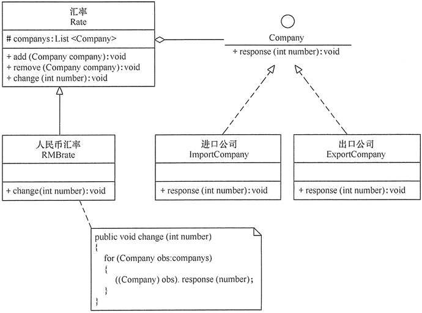
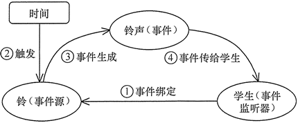
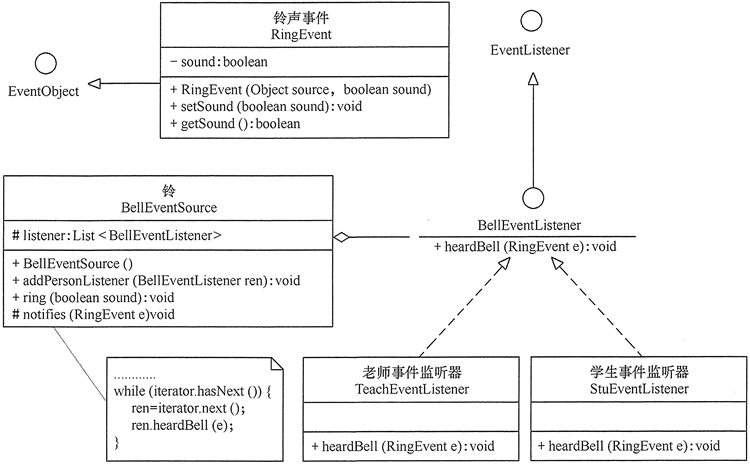
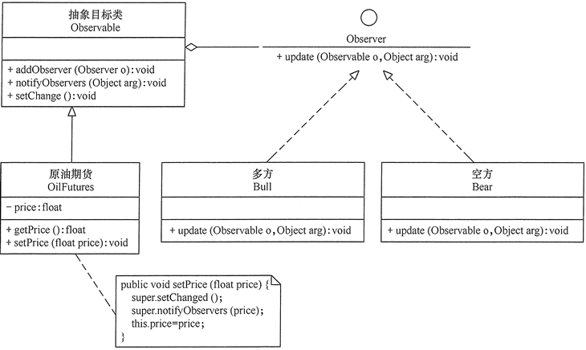

# 观察者模式(Observer）

在现实世界中，*许多对象并不是独立存在的，其中一个对象的行为发生改变可能会导致一个或者多个其他对象的行为也发生改变*。例如，某种商品的物价上涨时会导致部分商家高兴，而消费者伤心；还有，当我们开车到交叉路口时，遇到红灯会停，遇到绿灯会行。这样的例子还有很多，例如，股票价格与股民、微信公众号与微信用户、气象局的天气预报与听众、小偷与警察等。

在软件世界也是这样，例如，Excel 中的数据与折线图、饼状图、柱状图之间的关系；MVC 模式中的模型与视图的关系；事件模型中的事件源与事件处理者。所有这些，如果用观察者模式来实现就非常方便。

## 模式的定义与特点

**观察者（Observer）模式的定义：指多个对象间存在一对多的依赖关系，当一个对象的状态发生改变时，所有依赖于它的对象都得到通知并被自动更新**。这种模式有时又称作**发布-订阅模式**、**模型-视图模式**，它是对象行为型模式。

**主要优点如下:**

1. 降低了目标与观察者之间的耦合关系，两者之间是**抽象耦合关系**。
2. 目标与观察者之间建立了一套触发机制。

**主要缺点如下:**

1. 目标与观察者之间的依赖关系并没有完全解除，而且有可能出现**循环引用**。
2. 当观察者对象很多时，通知的发布会花费很多时间，影响程序的效率。

## 模式的结构与实现

实现观察者模式时要**注意具体目标对象和具体观察者对象之间不能直接调用，否则将使两者之间紧密耦合起来**，这违反了面向对象的设计原则。

#### 1. 模式的结构

观察者模式的主要角色如下。

1. **抽象主题（Subject）角色**：也叫抽象目标类，它提供了一个用于**保存观察者对象的聚集类**和增加、删除观察者对象的方法，以及通知所有观察者的抽象方法。
2. **具体主题（Concrete  Subject）角色**：也叫具体目标类，它实现抽象目标中的通知方法，当具体主题的内部状态发生改变时，通知所有注册过的观察者对象。
3. **抽象观察者（Observer）角色**：它是一个抽象类或接口，它包含了一个更新自己的抽象方法，当接到具体主题的更改通知时被调用。
4. **具体观察者（Concrete Observer）角色**：实现抽象观察者中定义的抽象方法，以便在得到目标的更改通知时更新自身的状态。


观察者模式的结构图如图 1 所示。


图1 观察者模式的结构图

#### 2. 模式的实现

观察者模式的实现代码如下：

```java
package observer;

import java.util.*;

public class ObserverPattern{    
    public static void main(String[] args){        
        Subject subject=new ConcreteSubject();   
        
        Observer obs1=new ConcreteObserver1();        
        Observer obs2=new ConcreteObserver2(); 
        
        subject.add(obs1);        
        subject.add(obs2);        
        subject.notifyObserver();    
    }
}

//抽象目标
abstract class Subject{    
    protected List<Observer> observers=new ArrayList<Observer>();      
    
    //增加观察者方法    
    public void add(Observer observer){        
        observers.add(observer);    
    }        
    
    //删除观察者方法    
    public void remove(Observer observer){        
        observers.remove(observer);    
    }       
    
    public abstract void notifyObserver(); //通知观察者方法
}

//具体目标
class ConcreteSubject extends Subject{    
    public void notifyObserver(){        
        System.out.println("具体目标发生改变...");        
        System.out.println("--------------");                      
        
        for(Object obs:observers){            
            ((Observer)obs).response();
        }           
    }          
}

//抽象观察者
interface Observer{    
    void response(); //反应
}

//具体观察者1
class ConcreteObserver1 implements Observer{    
    public void response(){        
        System.out.println("具体观察者1作出反应！");    
    }
}

//具体观察者2
class ConcreteObserver2 implements Observer{    
    public void response(){        
        System.out.println("具体观察者2作出反应！");    
    }
}
```


程序运行结果如下：

```
具体目标发生改变...
--------------
具体观察者1作出反应！
具体观察者2作出反应！
```

## 模式的应用实例

【例1】利用观察者模式设计一个程序，分析“人民币汇率”的升值或贬值对进口公司的进口产品成本或出口公司的出口产品收入以及公司的利润率的影响。

分析：当“人民币汇率”升值时，进口公司的进口产品成本降低且利润率提升，出口公司的出口产品收入降低且利润率降低；当“人民币汇率”贬值时，进口公司的进口产品成本提升且利润率降低，出口公司的出口产品收入提升且利润率提升。

这里的汇率（Rate）类是抽象目标类，它包含了保存观察者（Company）的 List 和增加/删除观察者的方法，以及有关汇率改变的抽象方法 change(int number)；

而人民币汇率（RMBrate）类是具体目标， 它实现了父类的 change(int number) 方法，即当人民币汇率发生改变时通过相关公司；

公司（Company）类是抽象观察者，它定义了一个有关汇率反应的抽象方法 response(int number)；

进口公司（ImportCompany）类和出口公司（ExportCompany）类是具体观察者类，它们实现了父类的 response(int number) 方法，即当它们接收到汇率发生改变的通知时作为相应的反应。图 2 所示是其结构图。


图2 人民币汇率分析程序的结构图


程序代码如下：

```java
package observer;
import java.util.*;

public class RMBrateTest{    
    public static void main(String[] args){        
        Rate rate=new RMBrate();                 
        Company watcher1=new ImportCompany();         
        Company watcher2=new ExportCompany();                   
        
        rate.add(watcher1);         
        rate.add(watcher2); 
        
        rate.change(10);        
        rate.change(-9);    
    }
}

//抽象目标：汇率
abstract class Rate{    
    protected List<Company> companys=new ArrayList<Company>();       
    
    //增加观察者方法    
    public void add(Company company)    {        
        companys.add(company);    
    }        
    
    //删除观察者方法    
    public void remove(Company company){        
        companys.remove(company);    
    }       
    
    public abstract void change(int number);
}

//具体目标：人民币汇率
class RMBrate extends Rate {    
    public void change(int number){               
        for(Company obs:companys){            
            ((Company)obs).response(number);        
        }           
    }
}

//抽象观察者：公司
interface Company{    
    void response(int number);
}

//具体观察者1：进口公司 
class ImportCompany implements Company {    
    public void response(int number){        
        if(number>0)        {            
            System.out.println("人民币汇率升值"+number+"个基点，降低了进口产品成本，提升了进口公司利润率。");         
        }else if(number<0){              
            System.out.println("人民币汇率贬值"+(-number)+"个基点，提升了进口产品成本，降低了进口公司利润率。");
        }    
    } 
} 

//具体观察者2：出口公司
class ExportCompany implements Company {    
    public void response(int number){        
        if(number>0){ 
            System.out.println("人民币汇率升值"+number+"个基点，降低了出口产品收入，降低了出口公司的销售利润率。");      
        }else if(number<0){             
            System.out.println("人民币汇率贬值"+(-number)+"个基点，提升了出口产品收入，提升了出口公司的销售利润率。");
        }  
    } 
}
```


程序运行结果如下：

```
人民币汇率升值10个基点，降低了进口产品成本，提升了进口公司利润率。
人民币汇率升值10个基点，降低了出口产品收入，降低了出口公司的销售利润率。
人民币汇率贬值9个基点，提升了进口产品成本，降低了进口公司利润率。
人民币汇率贬值9个基点，提升了出口产品收入，提升了出口公司的销售利润率。
```


观察者模式在软件幵发中用得最多的是窗体程序设计中的事件处理，窗体中的所有组件都是“事件源”，也就是目标对象，而事件处理程序类的对象是具体观察者对象。下面以一个学校铃声的事件处理程序为例，介绍 Windows 中的“事件处理模型”的工作原理。

【例2】利用观察者模式设计一个学校铃声的事件处理程序。

分析：在本实例中，学校的“铃”是事件源和目标，“老师”和“学生”是事件监听器和具体观察者，“铃声”是事件类。学生和老师来到学校的教学区，都会注意学校的铃，这叫事件绑定；当上课时间或下课时间到，会触发铃发声，这时会生成“铃声”事件；学生和老师听到铃声会开始上课或下课，这叫事件处理。这个实例非常适合用观察者模式实现，图 3 给出了学校铃声的事件模型。


图3 学校铃声的事件模型图

现在用“观察者模式”来实现该事件处理模型。

首先，定义一个铃声事件（RingEvent）类，它记录了铃声的类型（上课铃声/下课铃声）；

再定义一个学校的铃（BellEventSource）类，它是事件源，是观察者目标类，该类里面包含了监听器容器 listener，可以绑定监听者（学生或老师），并且有产生铃声事件和通知所有监听者的方法；

然后，定义一声事件监听者（BellEventListener）类，它是抽象观察者，它包含了铃声事件处理方法 heardBell(RingEvent e)；

最后，定义老师类（TeachEventListener）和学生类（StuEventListener），它们是事件监听器，是具体观察者，听到铃声会去上课或下课。

图 4 给出了学校铃声事件处理程序的结构。


图4 学校铃声事件处理程序的结构图


程序代码如下：

```java
package observer;
import java.util.*;

public class BellEventTest{    
    public static void main(String[] args)    {        
        BellEventSource bell=new BellEventSource();    //铃（事件源）            
        bell.addPersonListener(new TeachEventListener()); //注册监听器（老师）        
        bell.addPersonListener(new StuEventListener());    //注册监听器（学生）        
        bell.ring(true);   //打上课铃声        
        System.out.println("------------");           
        
        bell.ring(false);  //打下课铃声    
    }
}

//铃声事件类：用于封装事件源及一些与事件相关的参数
class RingEvent extends EventObject{       
    private static final long serialVersionUID=1L;    
    private boolean sound;    //true表示上课铃声,false表示下课铃声    
    
    public RingEvent(Object source,boolean sound){        
        super(source);        
        this.sound=sound;    
    }       
    
    public void setSound(boolean sound){        
        this.sound=sound;    
    }    
    
    public boolean getSound(){        
        return this.sound;    
    }
}

//目标类：事件源，铃
class BellEventSource{        
    private List<BellEventListener> listener; //监听器容器    
    
    public BellEventSource()    {         
        listener=new ArrayList<BellEventListener>();            
    }    
    
    //给事件源绑定监听器     
    public void addPersonListener(BellEventListener ren){         
        listener.add(ren);     
    }    
    
    //事件触发器：敲钟，当铃声sound的值发生变化时，触发事件。    
    public void ring(boolean sound){        
        String type=sound?"上课铃":"下课铃";        
        System.out.println(type+"响！");        
        RingEvent event=new RingEvent(this, sound);   
        
        notifies(event);    //通知注册在该事件源上的所有监听器                    
    }       
    
    //当事件发生时,通知绑定在该事件源上的所有监听器做出反应（调用事件处理方法）    
    protected void notifies(RingEvent e){         
        BellEventListener ren=null;         
        Iterator<BellEventListener> iterator=listener.iterator(); 
        
        while(iterator.hasNext()){             
            ren=iterator.next();             
            ren.heardBell(e);         
        }     
    }
}

//抽象观察者类：铃声事件监听器
interface  BellEventListener extends EventListener{    
    
    //事件处理方法，听到铃声    
    public void heardBell(RingEvent e);
}

//具体观察者类：老师事件监听器
class TeachEventListener implements BellEventListener{    
    public void heardBell(RingEvent e){                
        if(e.getSound()){            
            System.out.println("老师上课了...");                   
        }else{            
            System.out.println("老师下课了...");           
        }              
    }
}

//具体观察者类：学生事件监听器
class StuEventListener implements BellEventListener{    
    public void heardBell(RingEvent e){                
        if(e.getSound()){            
            System.out.println("同学们，上课了...");                   
        }else{            
            System.out.println("同学们，下课了...");           
        }              
    }
}
```


程序运行结果如下：

```
上课铃响！
老师上课了...
同学们，上课了...
------------
下课铃响！
老师下课了...
同学们，下课了...
```

## 模式的应用场景

通过前面的分析与应用实例可知观察者模式适合以下几种情形。

1. **对象间存在一对多关系，一个对象的状态发生改变会影响其他对象**。
2. **当一个抽象模型有两个方面，其中一个方面依赖于另一方面时，可将这二者封装在独立的对象中以使它们可以各自独立地改变和复用**。

## 模式的扩展

在 Java 中，通过 java.util.Observable 类和 java.util.Observer 接口定义了观察者模式，只要实现它们的子类就可以编写观察者模式实例。

#### 1. Observable类

Observable 类是抽象目标类，它有一个 Vector 向量，用于保存所有要通知的观察者对象，下面来介绍它最重要的 3 个方法。

1. void addObserver(Observer o) 方法：用于将新的观察者对象添加到向量中。
2. void notifyObservers(Object arg) 方法：调用向量中的所有观察者对象的 update。方法，通知它们数据发生改变。*通常越晚加入向量的观察者越先得到通知*。
3. void setChange() 方法：用来设置一个 boolean 类型的内部标志位，注明目标对象发生了变化。当它为真时，notifyObservers() 才会通知观察者。

#### 2. Observer 接口

Observer 接口是抽象观察者，它监视目标对象的变化，当目标对象发生变化时，观察者得到通知，并调用 void update(Observable o,Object arg) 方法，进行相应的工作。

【例3】利用 Observable 类和 Observer 接口实现原油期货的观察者模式实例。

分析：当原油价格上涨时，空方伤心，多方局兴；当油价下跌时，空方局兴，多方伤心。

本实例中的抽象目标（Observable)类在 Java 中已经定义，可以直接定义其子类，即原油期货（OilFutures)类，它是具体目标类，该类中定义一个 SetPriCe(float price) 方法，当原油数据发生变化时调用其父类的 notifyObservers(Object arg) 方法来通知所有观察者；

另外，本实例中的抽象观察者接口（Observer）在 Java 中已经定义，只要定义其子类，即具体观察者类（包括多方类 Bull 和空方类 Bear），并实现 update(Observable o,Object arg) 方法即可。

图 5 所示是其结构图。


图5 原油期货的观察者模式实例的结构图


程序代码如下：

```java
package observer;
import java.util.Observer;
import java.util.Observable;

public class CrudeOilFutures{    
    public static void main(String[] args){        
        OilFutures oil=new OilFutures();        
        Observer bull=new Bull(); //多方        
        Observer bear=new Bear(); //空方        
        oil.addObserver(bull);        
        oil.addObserver(bear);  
        
        oil.setPrice(10);        
        oil.setPrice(-8);    
    }
}

//具体目标类：原油期货
class OilFutures extends Observable{    
    private float price;       
    
    public float getPrice(){        
        return this.price;     
    }    
    
    public void setPrice(float price){        
        super.setChanged() ; //设置内部标志位，注明数据发生变化         
        super.notifyObservers(price);    //通知观察者价格改变了         
        this.price=price ;     
    }
}

//具体观察者类：多方
class Bull implements Observer{       
    public void update(Observable o,Object arg){        
        Float price=((Float)arg).floatValue(); 
        
        if(price>0){            
            System.out.println("油价上涨"+price+"元，多方高兴了！");        
        }else{            
            System.out.println("油价下跌"+(-price)+"元，多方伤心了！");        
        }    
    }
}

//具体观察者类：空方
class Bear implements Observer{       
    public void update(Observable o,Object arg){        
        Float price=((Float)arg).floatValue();        
        
        if(price>0){            
            System.out.println("油价上涨"+price+"元，空方伤心了！");        
        }else{            
            System.out.println("油价下跌"+(-price)+"元，空方高兴了！");        
        }    
    }
}
```


程序运行结果如下：

```
油价上涨10.0元，空方伤心了！
油价上涨10.0元，多方高兴了！
油价下跌8.0元，空方高兴了！
油价下跌8.0元，多方伤心了
```
