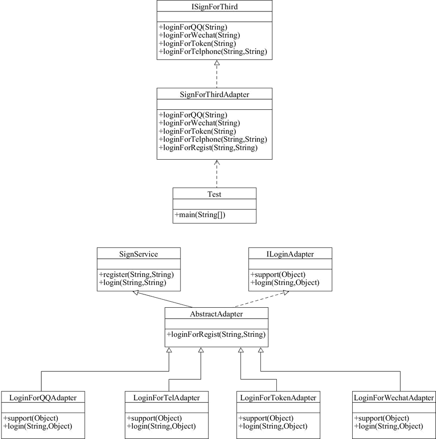

# 适配器重构第三方登录

在[适配器模式详解]一节我们已经了解了适配器模式，下面使用类适配器来实现一个实际的业务场景，解决实际问题。

年纪稍微大一点的小伙伴一定知道，很早以前开发的老系统大部分都有登录接口。随着业务的发展和社会的进步，单纯的依赖用户名和密码登录显然已经不能满足用户的需求了。

现在，大部分系统都支持多种登录方式，如 QQ 登录、微信登录、手机登录、微博登录、自动登录等。虽然登录形式丰富，但是登录后的处理逻辑不用变，都是将登录状态保存到 Session，遵循开闭原则。

首先创建统一的返回结果 ResultMsg 类：

```java
public class ResultMsg {    
    private int code;    
    private String msg;    
    private Object data;    
    
    public ResultMsg(int code, String msg, Object data) {        
        this.code = code;        
        this.msg = msg;        
        this.data = data;    
    }    
    
    // 省略set和get方法
}
```

假设在老系统中，处理登录逻辑的代码在 SignService 类中。

```java
public class SignService {    
    public ResultMsg register(String username, String password) {        
        return new ResultMsg(200, "注册成功", new user());    
    }    
      
    public ResultMsg login(String username, String password) {        
        return null;    
    }
}
```

为了遵循开闭原则，不修改老系统的代码。下面开启代码重构之路，创建 User 类。

```java
public class User {    
    private String username;    
    private String password;    
    private String mid;    
    private String info;    
    
    // 省略set和get方法
}
```

我们也不改动运行非常稳定的代码，创建目标接口角色 ISignForThird。

```java
public interface ISignForThird {    
    ResultMsg loginForQQ(String openId);    
    ResultMsg loginForWechat(String openId);    
    ResultMsg loginForToken(String token);    
    ResultMsg loginForTelphone(String phone, String code);
}
```

增加 Adapter 角色实现兼容。创建一个新的类 SignForThirdAdapter，继承原来的逻辑，运行非常稳定的代码我们不去改动。

```java
public class SignForThirdAdapter extends SignService implements ISignForThird {    
    public ResultMsg loginForQQ(String openId) {        
        return loginForRegist(openId, null);    
    }    
    
    public ResultMsg loginForWechat(String openId) {       
        return loginForRegist(openId, null);    
    }    
    
    public ResultMsg loginForToken(String token) {        
        return loginForRegist(token, null);    
    }    
    
    public ResultMsg loginForTelphone(String phone, String code) {        
        return loginForRegist(phone, null);    
    }    
    
    private ResultMsg loginForRegist(String username, String password) {        
        if (null == password) {            
            password = "THIRD_EMPTY";        
        }        
        super.register(username, password);        
        return super.login(username, password);    
    }
}
```

客户端测试代码如下：

```java
public static void main(String[] args) {    
    SignForThirdAdapter adapter = new SignForThirdAdapter(); 
    
    adapter.login("C语言中文网", "123456");    
    adapter.loginForQQ("1154852654");    
    adapter.loginForWechat("455256225");
}
```

这样通过这么一个简单的适配动作，我们完成了代码兼容。当然，代码还可以更加优雅。

## 使用接口适配器优化代码

下面根据不同的登录方式，创建不同的 Adapter。首先创建 LoginAdapter 接口。

```java
public interface ILoginAdapter {    
    boolean support(Object object);    
    ResultMsg login(String id, Object adapter);
}
```

然后创建一个抽象类 AbstractAdapter 继承 SignService 原有的功能，同时实现 ILoginAdapter 接口，再分别实现不同的登录适配。

```java
public abstract class AbstractAdapter extends SignService implements ILoginAdapter {    
    protected ResultMsg loginForRegist(String username, String password) {        
        if (null == password) {            
            password = "THIRD_EMPTY";        
        }        
        
        super.register(username, password);        
        return super.login(username, password);    
    }
}
```

QQ 登录 LoginForQQAdapter 如下。

```java
public class LoginForQQAdapter extends AbstractAdapter {    
    public boolean support(Object adapter) {        
        return adapter instanceof LoginForQQAdapter;    
    }    
    
    public ResultMsg login(String id, Object adapter) {        
        if (!support(adapter)) {            
            return null;        
        }        
        
        //accesseToken        
        //time       
        return super.loginForRegist(id, null);    
    }
}
```

手机登录 LoginForTelAdapter 如下。

```java
public class LoginForTelAdapter extends AbstractAdapter {    
    public boolean support(Object adapter) {        
        return adapter instanceof LoginForTelAdapter;   
    }    
    
    public ResultMsg login(String id, Object adapter) {        
        return super.loginForRegist(id, null);    
    }
}
```

Token 自动登录 LoginForTokenAdapter 如下。

```java
public class LoginForTokenAdapter extends AbstractAdapter {    
    public boolean support(Object adapter) {        
        return adapter instanceof LoginForTokenAdapter;    
    }    
    
    public ResultMsg login(String id, Object adapter) {        
        return super.loginForRegist(id, null);    
    }
}
```

微信登录 LoginForWechatAdapter 如下。

```java
public class LoginForWechatAdapter extends AbstractAdapter {    
    public boolean support(Object adapter) {        
        return adapter instanceof LoginForWechatAdapter;    
    }    
    
    public ResultMsg login(String id, Object adapter) {       
        return super.loginForRegist(id, null);    
    }   
}
```

接着创建适配器 SignForThirdAdapter 类，实现目标接口 ISignForThird 完成兼容。

```java
public class SignForThirdAdapter extends SignService implements ISignForThird {    
    public ResultMsg loginForQQ(String openId) {        
        return loginForRegist(openId, null);    
    }    
    
    public ResultMsg loginForWechat(String openId) {        
        return loginForRegist(openId, null);    
    }    
    
    public ResultMsg loginForToken(String token) {        
        return loginForRegist(token, null);    
    }    
    
    public ResultMsg loginForTelphone(String phone, String code) {        
        return loginForRegist(phone, null);    
    }    
    
    private ResultMsg loginForRegist(String username, String password) {        
        if (null == password) {            
            password = "THIRD_EMPTY";        
        }        
        
        super.register(username, password);        
        return super.login(username, password);    
    }
}
```

客户端测试代码如下。

```java
public static void main(String[] args) {        
    ISignForThird adapter = new SignForThirdAdapter();        
    adapter.loginForQQ("ssfsfafxzsds");
}
```

最后来看如下图所示的类图：




到这里，在遵循开闭原则的前提下，我们完整的实现了一个兼容多平台登录的业务场景。

> 上述设计并不完美，仅供参考，感兴趣的小伙伴可以继续完善这段代码。比如，适配器类中的参数类型目前设置为 String，改为 Object[] 应该更合理。

学到这里，大家可能觉得适配器模式和策略模式区别不大。

适配器模式主要解决的是功能兼容的问题，单场景的适配和策略不会有对比，但是多场景的适配可能会让大家很容易产生联想和混淆。

此处我们在每个适配器上都加了一个 support() 方法，用来判断是否兼容。support() 方法的参数也是 Object 的，而 support() 来自于接口。适配器的实现逻辑并不依赖于接口，完全可以将 ILoginAdapter 接口去掉。加上接口，只是为了代码规范。

上面的代码也可以说是策略模式，简单工厂模式和适配器模式的综合应用，LoginAdapter 接口这里体现策略模式的思想，实现兼容的 SignForThirdAdapter 类中的 processLogin 方法体现了适配器模式的思想，里面的实现体现了简单工厂的思想。