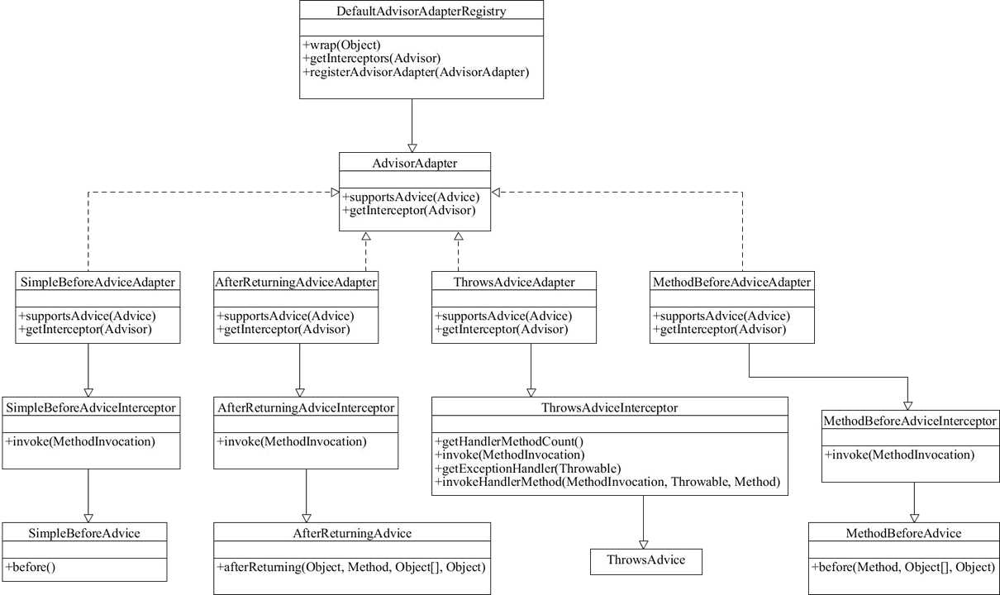
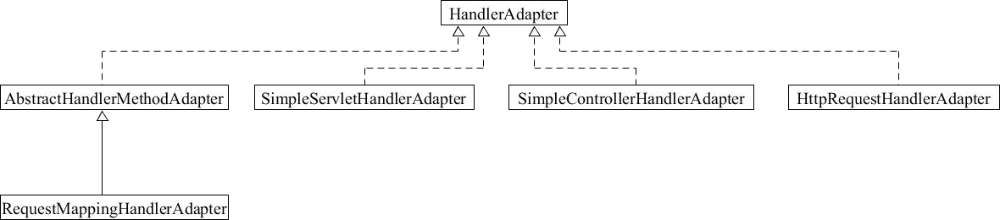

# 适配器模式在Spring源码中的应用

### Spring Aop 中的适配器模式

在 Spring 的 Aop 中，适配器模式应用的非常广泛。Spring 使用 Advice（通知）来增强被代理类的功能，Advice 的类型主要有 BeforeAdvice、AfterReturningAdvice、ThrowsAdvice。每种 Advice 都有对应的拦截器，即 MethodBeforeAdviceInterceptor、AfterReturningAdviceInterceptor、ThrowsAdviceInterceptor。

各种不同类型的 Interceptor，通过适配器统一对外提供接口，如下类图所示：client ---> target ---> adapter ---> interceptor ---> advice。最终调用不同的 advice来实现被代理类的增强。




Spring AOP 的 AdvisorAdapter 类有 4 个实现类，即 SimpleBeforeAdviceAdapter、MethodBeforeAdviceAdapter、AfterReturningAdviceAdapter 和 ThrowsAdviceAdapter。先来看顶层接口 AdvisorAdapter。


```java
public interface AdvisorAdapter {    
    boolean supportsAdvice(Advice advice);   
    MethodInterceptor getInterceptor(Advisor advisor);
}
```

再来看 MethodBeforeAdviceAdapter 类。

```java
class MethodBeforeAdviceAdapter implements AdvisorAdapter, Serializable {    
    
    @Override    
    public boolean supportsAdvice(Advice advice) {        
        return (advice instanceof MethodBeforeAdvice);    
    }    
    
    @Override    
    public MethodInterceptor getInterceptor(Advisor advisor) {        
        MethodBeforeAdvice advice = (MethodBeforeAdvice) advisor.getAdvice();        
        return new MethodBeforeAdviceInterceptor(advice);    
    }
}
```

这里就不把其他两个类的代码贴出来了。Spring 会根据不同的 AOP 配置来确定使用对应的 Advice，与策略模式不同的是，一个方法可以同时拥有多个 Advice。

### SpringMVC中的适配器模式

适配器模式在 SpringMVC 中的经典使用体现在它的核心方法 doDispatch 方法中，再来看一个 Spring MVC 中的 HandlerAdapter 类，它也有多个子类，类图如下。




其适配调用的关键代码还是在 DispatcherServlet 的 doDispatch() 方法中，代码如下。

```java
protected void doDispatch(HttpServletRequest request, HttpServletResponse response) throws Exception {
    HttpServletRequest processedRequest = request;    
    HandlerExecutionChain mappedHandler = null;    
    boolean multipartRequestParsed = false;    
    WebAsyncManager asyncManager = WebAsyncUtils.getAsyncManager(request);    
    
    try {        
        ModelAndView mv = null;        
        Exception dispatchException = null;        
        try {            
            processedRequest = checkMultipart(request);            
            multipartRequestParsed = (processedRequest != request);            
            
            // 此处通过HandlerMapping来映射Controller            
            mappedHandler = getHandler(processedRequest);            
            if (mappedHandler == null || mappedHandler.getHandler() == null) {
                noHandlerFound(processedRequest, response);                
                return;            
            }            
            
            // 获取适配器            
            HandlerAdapter ha = getHandlerAdapter(mappedHandler.getHandler());            
            
            // Process last-modified header, if supported by the handler.            
            String method = request.getMethod();            
            boolean isGet = "GET".equals(method);            
            if (isGet || "HEAD".equals(method)) {                
                long lastModified = ha.getLastModified(request, mappedHandler.getHandler());
                if (logger.isDebugEnabled()) {                    
                    logger.debug("Last-Modified value for [" + getRequestUri(request) +
                                 "] is: " + lastModified);                
                }                
                
                if (new ServletWebRequest(request, response).checkNotModified(lastModified) && isGet) {
                    return;                
                }            
            }            
            
            if (!mappedHandler.applyPreHandle(processedRequest, response)) {                
                return;            
            }            
            
            // 通过适配器调用controller的方法并返回ModelAndView            
            mv = ha.handle(processedRequest, response, mappedHandler.getHandler());            
            if (asyncManager.isConcurrentHandlingStarted()) {                
                return;            
            }            
            
            applyDefaultViewName(processedRequest, mv);
            mappedHandler.applyPostHandle(processedRequest, response, mv);        
        } catch (Exception ex) {            
            dispatchException = ex;        
        } catch (Throwable err) {            
            // As of 4.3, we're processing Errors thrown from handler methods as well,            
            // making them available for @ExceptionHandler methods and other scenarios.
            dispatchException = new NestedServletException("Handler dispatch failed", err);        
        }        
        
        processDispatchResult(processedRequest, response, mappedHandler, mv, dispatchException);   
    } catch (Exception ex) {        
        triggerAfterCompletion(processedRequest, response, mappedHandler, ex);    
    } catch (Throwable err) {        
        triggerAfterCompletion(processedRequest, response, mappedHandler,                
                               new NestedServletException("Handler processing failed", err));   
    } finally {        
        if (asyncManager.isConcurrentHandlingStarted()) {            
            // Instead of postHandle and afterCompletion            
            if (mappedHandler != null) {  
                mappedHandler.applyAfterConcurrentHandlingStarted(processedRequest, response);            
            }        
        } else {            
            // Clean up any resources used by a multipart request.            
            if (multipartRequestParsed) {                
                cleanupMultipart(processedRequest);            
            }        
        }    
    }
}
```

在 doDispatch() 方法中调用了 getHandlerAdapter() 方法，代码如下。

```java
protected HandlerAdapter getHandlerAdapter(Object handler) throws ServletException {    
    if (this.handlerAdapters != null) {        
        Iterator var2 = this.handlerAdapters.iterator();        
        
        while (var2.hasNext()) {            
            HandlerAdapter ha = (HandlerAdapter) var2.next();            
            if (this.logger.isTraceEnabled()) {                
                this.logger.trace("Testing handler adapter [" + ha + "]");            
            }            
            
            if (ha.supports(handler)) {               
                return ha;            
            }        
        }    
    }    
    throw new ServletException("No adapter for handler [" + handler + 
                               "]:The DispatcherServlet configuration needs to include a HandlerAdapter that supports this handler");
}
```

在 getHandlerAdapter() 方法中循环调用 supports() 方法来判断是否兼容，循环迭代集合中的 Adapter 在初始化时早已被赋值。