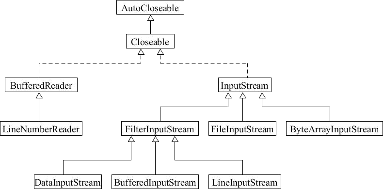

# 装饰器模式在JDK源码中的应用

装饰器模式在源码中应用的非常多，其中在 JDK 中体现最明显的类就是与 I/O 相关的类，如 BufferedReader、InputStream、OutputStream 及它们的子类。

下面以 InputStream 为例进行讲解。

- FileInputStream 是 InputStream 的子类，用来读取文件字节流
- BufferedInputStream 是 InputStream 的子类 FilterInputStream 的子类，为可缓存的字节流
- DataInputStream 也是FilterInputStream 的子类，可直接读取 Java 基本类型的字节流


下面为 InputStream 的类图，如下所示。




如果需要一个能够读取文件且可缓存的字节流，可以继承 BufferedInputStream。如果需要一个能够读取文件且直接读取基本类型的字节流，可以继承 FileDataInputStream。但是如果用继承方式，那类的层级与种类会多到爆炸。

为了解决此类问题，使用了装饰器模式。

InputStream 部分源码如下：

```java
public abstract class InputStream implements Closeable {    
    public int read(byte b[], int off, int len) throws IOException {
    }
}
```

FileInputStream 部分源码如下：

```java
public class FileInputStream extends InputStream {    
    public FileInputStream(String name) throws FileNotFoundException {        
        this(name != null ? new File(name) : null);    
    }    
    
    public int read(byte b[], int off, int len) throws IOException {        
        return readBytes(b, off, len);    
    }
}
```

BufferedInputStream 源码精简，继承 InputStream 类，如下：

```java
public class BufferedInputStream extends InputStream {    
    protected volatile InputStream in;    
    
    public BufferedInputStream(InputStream in) {        
        this.in = in;    
    }    
    
    public synchronized int read(byte b[], int off, int len) throws IOException {    
        ...    
    }
}
```

DataInputStream 源码精简，继承 InputStream 类，如下：

```java
public class DataInputStream extends InputStream {    
    protected volatile InputStream in;    
    
    public DataInputStream(InputStream in) {        
        this.in = in;    
    }    
    
    public final int read(byte b[], int off, int len) throws IOException {        
        return in.read(b, off, len);    
    }
}
```

组合各种类型的字节流，使用

```java
//读取文件 + 可缓存的字节流
new BufferedInputStream(new FileInputStream("D:/c.txt"));

//读取文件 + 直接读取基本类型的字节流
new DataInputStream(new FileInputStream("D:/c.txt"));
```