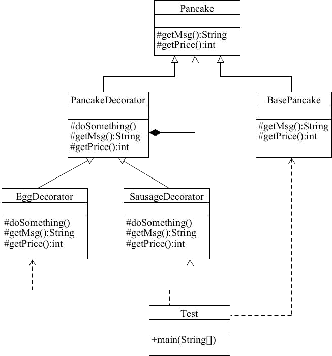

# 使用装饰器模式解决煎饼“加码”问题

在《[装饰设计模式](http://c.biancheng.net/view/1366.html)》一节中，我们提到了煎饼，煎饼中可以加鸡蛋，也可以加香肠，但是不管怎么“加码”，都还是一个煎饼。

下面用代码来模拟给煎饼“加码”的业务场景。为了能让大家更好的理解装饰器模式带来的好处，先来看不用装饰器模式的情况。

首先创建一个煎饼 Pancake 类。

```java
public class Pancake {    
    protected String getMsg() {        
        return "煎饼";    
    }    
    
    public int getPrice() {        
        return 5;    
    }
}
```

然后创建一个加鸡蛋的煎饼 PancakeWithEgg 类。

```java
public class PancakeWithEgg extends Pancake {    
    
    @Override    
    protected String getMsg() {        
        return super.getMsg() + "一个鸡蛋";    
    }    
    
    @Override    //加1个鸡蛋加1元钱    
    protected int getPrice() {        
        return super.getPrice() + 1;    
    }
}
```

再创建一个既加鸡蛋又加香肠的 PancakeWithEggAndSausage 类。

```java
public class PancakeWithEggAndSausage extends PancakeWithEgg {    
    
    @Override    
    protected String getMsg() {        
        return super.getMsg() + "一根香肠";    
    }    
    
    @Override    //加1根香肠加2元钱    
    protected int getPrice() {        
        return super.getPrice() + 2;    
    }
}
```

最后编写客户端测试代码。

```java
public class Test {    
    public static void main(String[] args) {        
        Pancake pancake = new Pancake();        
        System.out.println(pancake.getMsg() + 
                           ",总价格：" + pancake.getPrice());        
        
        Pancake pancakeWithEgg = new PancakeWithEgg();        
        System.out.println(pancakeWithEgg.getMsg() + 
                           ",总价格：" + pancakeWithEgg.getPrice());        
        
        Pancake pancakeWithEggAndSausage = new PancakeWithEggAndSausage();  
        System.out.println(pancakeWithEggAndSausage.getMsg() + 
                           ",总价格：" + pancakeWithEggAndSausage.getPrice());    }}
```

运行结果如下所示：

煎饼,总价格：5
煎饼一个鸡蛋,总价格：6
煎饼一个鸡蛋一根香肠,总价格：8

运行结果是没有问题的。但是，如果用户需要一个加 2 个鸡蛋 1 根香肠的煎饼，用以上类结构是创建不出来的，也无法自动计算出价格，除非再创建一个类做定制。如果需求改变，那么一直加定制显然是不科学的。


------


#### 使用装饰器模式解决煎饼加码问题

下面用装饰器模式来解决上面的问题，首先创建一个煎饼的抽象 Pancake 类。

```java
public abstract class Pancake {    
    protected abstract String getMsg();    
    protected abstract int getPrice();
}
```

创建一个基本的煎饼（或者说是基本套餐）BasePancake 类。

```java
public class BasePancake extends Pancake {    
    protected String getMsg() {        
        return "煎饼";    
    }    
    
    public int getPrice() {        
        return 5;    
    }
}
```

然后创建一个扩展套餐的抽象装饰器 PancakeDecorator 类。

```java
public abstract class PancakeDecorator extends Pancake {    
    //静态代理，委派    
    private Pancake pancake;    
    
    public PancakeDecorator(Pancake pancake) {        
        this.pancake = pancake;    
    }    
    
    protected abstract void doSomething();    
    
    @Override    
    protected String getMsg() {        
        return this.pancake.getMsg();    
    }    
    
    @Override    
    public int getPrice() {        
        return this.pancake.getPrice();    
    }
}
```

创建鸡蛋装饰器 EggDecorator 类。

```java
public class EggDecorator extends PancakeDecorator {    
    public EggDecorator(Pancake pancake) {        
        super(pancake);    
    }    
    
    protected void doSomething() {    
    }    
    
    @Override    
    protected String getMsg() {        
        return super.getMsg() + "1个鸡蛋";    
    }    
    
    @Override    
    public int getPrice() {        
        return super.getPrice() + 1;    
    }
}
```

创建香肠装饰器 SausageDecorator 类。

```java
public class SausageDecorator extends PancakeDecorator {    
    public SausageDecorator(Pancake pancake) {        
        super(pancake);    
    }    
    
    protected void doSomething() {    
    }    
    
    @Override    
    protected String getMsg() {        
        return super.getMsg() + "1根香肠";    
    }    
    
    @Override    
    public int getPrice() {        
        return super.getPrice() + 2;    
    }
}
```

客户端测试代码如下。

```java
public class Test {    
    public static void main(String[] args) {        
          
        //买一个煎饼        
        Pancake pancake = new BasePancake();        
        
        //加一个鸡蛋        
        pancake = new EggDecorator(pancake);        
        
        //再加一个鸡蛋        
        pancake = new EggDecorator(pancake);        
        
        //再加一根香肠        
        pancake = new SausageDecorator(pancake);        
        
        //与静态代理的最大区别就是职责不同        
        //静态代理不一定要满足 is-a 的关系        
        //静态代理会做功能增强，同一个职责变得不一样    
        
        //装饰器更多考虑的是扩展        
        System.out.println(pancake.getMsg() + ",总价：" + pancake.getPrice());    
    }
}
```

运行结果如下所示。

煎饼1个鸡蛋1个鸡蛋1根香肠,总价：9

最后来看类图，如下图所示。

