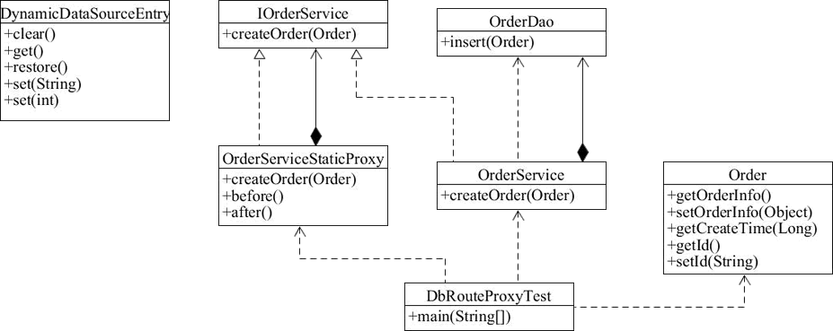

# 使用代理模式切换数据源

学了代理模式后，小伙伴们可能还是不知道如何将代理模式应用到实际业务场景中，下面来看一个实际的业务场景。

在分布式业务场景中，通常会对数据库进行分库分表，这样使用 Java 操作时就可能需要配置多个数据源，可以通过设置数据源路由来动态切换数据源。本节分别使用静态代理和动态代理来切换数据源。

首先创建 Order 订单类。

```java
public class Order {    
    private Object orderInfo;    
    private Long createTime;    
    private String id;   
    
    public Object getOrderInfo() {        
        return orderInfo;    
    }    
    
    public void setOrderInfo(Object orderInfo) {        
        this.orderInfo = orderInfo;    
    }    
    
    public Long getCreateTime() {        
        return createTime;    
    }    
    
    public void setCreateTime(Long createTime) {        
        this.createTime = createTime;    
    }    
    
    public String getId() {        
        return id;    
    }    
    
    public void setId(String id) {        
        this.id = id;    
    }
}
```

创建 OrderDao 持久层操作类。

```java
public class OrderDao {    
    public int insert(Order order) {        
        System.out.println("OrderDao创建Order成功");        
        return 1;    
    }
}
```

创建 IOrderService 接口。

```java
public interface IOrderService {    
    int createOrder(Order order);
}
```

创建 OrderService 实现类。

```java
public class OrderService implements IOrderService {    
    private OrderDao orderDao;    
    
    public OrderService() {        
        //如果使用Spring，这里应该是自动注入的        
        //为了使用方便，我们在构造方法中直接将orderDao初始化        
        orderDao = new OrderDao();    
    }    
    
    @Override    
    public int createOrder(Order order) {        
        System.out.println("OrderService调用orderDao创建订单");        
        return orderDao.insert(order);    
    }
}
```

## 使用静态代理切换数据源

以下主要实现根据订单创建时间自动按年来进行分库的功能。根据开闭原则，通过代理对象来完成数据源路由对象的创建。

创建 DynamicDataSourceEntry 类，使用 ThreadLocal 的单例实现。

```java
//动态切换数据源
public class DynamicDataSourceEntry {    
    //默认数据源    
    public final static String DEFAULT_SOURCE = null;    
    private final static ThreadLocal<String> local = new ThreadLocal<String>();   
    
    private DynamicDataSourceEntry() {    
    }    
    
    //清空数据源    
    public static void clear() {        
        local.remove();    
    }    
    
    //获取当前正在使用的数据源名字    
    public static String get() {        
        return local.get();    
    }    
    
    //还原当前切换的数据源    
    public static void restore() {        
        local.set(DEFAULT_SOURCE);    
    }    
    
    //设置已知名字的数据源    
    public static void set(String source) {        
        local.set(source);    
    }    
    
    //根据年份动态设置数据源    
    public static void set(int year) {        
        local.set("DB_" + year);    
    }
}
```

创建切换数据源的代理类 OrderServiceStaticProxy。

```java
import java.text.SimpleDateFormat;
import java.util.Date;

public class OrderServiceStaticProxy implements IOrderService {    
    private SimpleDateFormat yearFormat = new SimpleDateFormat("yyyy");    
    private IOrderService orderService;    
    
    public OrderServiceStaticProxy(IOrderService orderService) {        
        this.orderService = orderService;    
    }    
    
    public int createOrder(Order order) {        
        before();    
        
        Long time = order.getCreateTime();        
        Integer dbRouter = Integer.valueOf(yearFormat.format(new Date(time)));        
        System.out.println("静态代理类自动分配到【DB_" + dbRouter + "】数据源处理数据"); 
        
        DynamicDataSourceEntry.set(dbRouter);       
        orderService.createOrder(order);  
        
        after();        
        return 0;    
    }    
    
    public void before() {        
        System.out.println("代理模式之前的方法");    
    }    
    
    public void after() {        
        System.out.println("代理模式之后的方法");    
    }
}
```

DbRouteProxyTest 类测试代码如下。

```java
public class DbRouteProxyTest {    
    public static void main(String[] args) {        
        try {            
            Order order = new Order();            
            SimpleDateFormat sdf = new SimpleDateFormat("yyyy/MM/dd");            
            Date date = sdf.parse("2018/01/01");            
            order.setCreateTime(date.getTime());   
            
            IOrderService orderService = new OrderServiceStaticProxy(new OrderService()); 
            orderService.createOrder(order);        
        } catch (ParseException e) {            
            e.printStackTrace();        
        }    
    }
}
```

运行结果如下所示：

代理模式之前的方法
静态代理类自动分配到【DB_2018】数据源处理数据
OrderService调用orderDao创建订单
OrderDao创建Order成功
代理模式之后的方法

运行结果符合预期，类图如下所示：




动态代理和静态代理的基本思路是一致的，只不过动态代理的功能更强大，随着业务的扩展，适应性更强。

## 使用动态代理实现无感知切换数据源

在学习了上面的案例后，下面我们使用动态代理实现无感知切换数据源，可以加深小伙伴们对动态代理的印象。

创建动态代理的类 OrderServiceDynamicProxy，代码如下：

```java
public class OrderServiceDynamicProxy implements InvocationHandler {    
    private SimpleDateFormat yearFormat = new SimpleDateFormat("yyyy");    
    private Object target;    
    
    @Override    
    public Object invoke(Object proxy, Method method, Object[] args) throws Throwable { 
        before(args[0]);        
        Object object = method.invoke(target, args);        
        after();    
        
        return object;    
    }    
    
    private void before(Object target) {        
        System.out.println("代理模式之前的方法");        
        Long time = null;   
        
        try {            
            time = (Long) target.getClass().getMethod("getCreatTime").invoke(target);        
        } catch (Exception e) {            
            e.printStackTrace();        
        }        
        
        Integer dbRouter = Integer.valueOf(yearFormat.format(new Date(time)));        
        System.out.println("静态代理类自动分配到【DB_" + dbRouter + "】数据源处理数据");
        DynamicDataSourceEntry.set(dbRouter);    
    }    
    
    private void after() {        
        System.out.println("代理模式之后的方法");    
    }
}
```

客户端测试代码如下：

```java
public static void main(String[] args) {    
    try {        
        Order order = new Order();        
        SimpleDateFormat sdf = new SimpleDateFormat("yyyy/MM/dd");        
        Date date = sdf.parse("2018/01/01");        
        order.setCreateTime(date.getTime());        
        
        IOrderService orderService = new OrderServiceStaticProxy(new OrderService());
        orderService.createOrder(order);    
    } catch (ParseException e) {        
        e.printStackTrace();    
    }
}
```

运行结果如下：

代理模式之前的方法
静态代理类自动分配到【DB_2018】数据源处理数据
OrderService调用orderDao创建订单
OderDao创建Order成功
代理模式之后的方法

由运行结果可以看出，使用动态代理修改后的代码也能够达到相同的运行效果。但是，使用动态代理实现之后，不仅能实现 Order 的数据源动态路由，还可以实现其他类的数据源路由。

> 需要注意的是，这里有一个比较重要的约定，即（实体类）必须实现 getCreateTime() 方法，因为路由规则是根据时间来运算的，可以通过接口规范达到约束的目的。