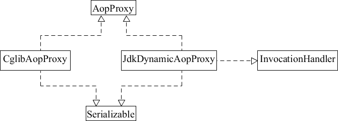

# 代理模式在Spring源码中的应用

我们在使用 Spring AOP 时，需要先配置好 ProxyFactoryBean，然后通过 ac.getBean(bean id) 来获取 ProxyFactoryBean 代理的对象。而 ProxyFactoryBean 类使用 ProxyFactoryBean.getObject() 方法获取返回的对象，即代理对象。

下面先看 ProxyFactoryBean 类中的核心方法 getObject()，源码如下：

```java
public Object getObject() throws BeansException {    
    initializeAdvisorChain();   
    
    if (isSingleton()) {        
        return getSingletonInstance();    
    }else {        
        if (this.targetName == null) {            
            logger.info("Using non-singleton proxies with singleton targets is often undesirable. " + 
                        "Enable prototype proxies by setting the 'targetName' property.");       
        } 
        
        return newPrototypeInstance();    
    }
}
```

在 getObject() 方法中，主要调用 getSingletonInstance() 和 newPrototypeInstance() 方法。

**在 Spring 的配置中，如果不做任何设置，则 Spring 代理生成的 Bean 都是单例对象**。如果修改 scope，则每次都创建一个新的原型对象。newPrototypeInstance() 里的逻辑比较复杂，教程后面会详细讲解，这里简单了解即可。

Spring 使用动态代理实现 AOP 时有两个非常重要的类，即 JdkDynamicAopProxy 类和 CglibAopProxy 类，其类图如下：




Spring 中的代理选择如下：

- **当 Bean 有实现接口时，Spring 会用 JDK 动态代理方式**
- **当 Bean 没有实现接口时，Spring 会选择 CGLib 动态代理方式**


Spring 可以通过配置强制使用 CGLib 动态代理，只需在 Spring 的配置文件中加入如下代码即可。

<aop:aspectj-autoproxy proxy-target-class="true"/>